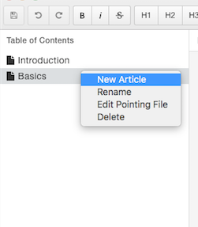

= asciidoc template

This is an asciidoc example. Inter documents testing and source code highlighting callouts.

* Describe multiple authors using semi-colon character.
....
author1<author1@email>;
author2<author2@email>
....

* Inter document reference test with <<sample#finalStep, move to finalStep section>>
If you click this link, you will move to the specific section in inter_doc_ref_test.adoc file

* image with center align

* source code with description

source code
....
[source, swift]
.optionals.swift
----
let user = "moon" // 1
let userName: String? // 2
----
<1> type inference
<2> optionals
....

results are

[source, swift]
.optionals.swift
----
let user = "moon" // 1
let userName: String? // 2
----
<1> type inference
<2> optionals
